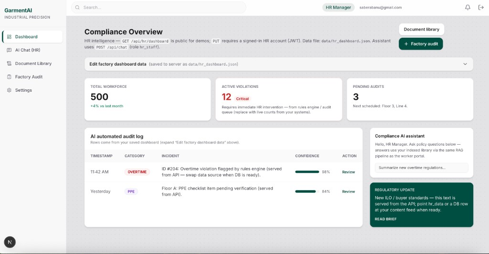

# GarmentAI

**Industrial precision for garment-factory knowledge.**  
Role-aware **RAG** (retrieval-augmented generation) over labour law, compliance manuals, and your factory’s own HR documents—with **JWT auth**, **ChromaDB** vector search, and a **Next.js** dashboard built for **Workers**, **HR Managers**, and **Compliance / Auditors**.

<p align="center">
  
</p>

<p align="center">
  <sub>HR dashboard: KPIs, AI-assisted audit log, policy chat (RAG), document library, and factory audit entry points.</sub>
</p>

---

## Why this project exists

Garment factories operate under dense **labour rules**, **buyer compliance**, and **internal HR** policies. Staff need answers **fast**, in **Bangla or English**, without hunting PDFs—while **sensitive** worker or factory data must stay **role-gated**. GarmentAI is a **prototype knowledge system** that combines:

| Capability | What visitors should know |
|------------|---------------------------|
| **Policy-aware Q&A** | Questions are answered using **retrieved evidence** from indexed documents, then phrased by an LLM (default: **Groq**). |
| **Role-based access** | **Worker**, **HR staff**, and **Compliance** roles see different navigation and retrieval scopes (**RBAC** in API + vector metadata). |
| **HR document library** | HR can **upload PDFs** (profiles, payroll, recruitment, etc.); the pipeline **extracts → chunks → embeds (E5) → stores in Chroma** for chat retrieval. |
| **Operational dashboards** | HR sees **workforce / violation / audit** style KPIs and logs (demo data from API; swappable for a real DB later). |
| **Factory audit support** | Dedicated **Factory Audit** flow to prepare evidence-backed answers during inspections. |

For a **deeper technical walkthrough** of the chat path (browser → FastAPI → Chroma → Groq), see [`docs/hr-chat-architecture.md`](docs/hr-chat-architecture.md).  
For **Week 7 design evaluation (AHP)** coursework, see [`docs/Week7-Design-Evaluation-AHP-Report.md`](docs/Week7-Design-Evaluation-AHP-Report.md).

---

## Tech stack (at a glance)

| Layer | Technology |
|--------|------------|
| **Frontend** | Next.js (App Router), TypeScript, Tailwind |
| **Backend** | FastAPI (Python 3) |
| **Vector DB** | Chroma (persistent, local `data/chroma_data/`) |
| **Embeddings** | `intfloat/multilingual-e5-small` (query/chunk prefixes for RAG) |
| **LLM (generation)** | Groq API (OpenAI-compatible), configurable via `.env` |
| **Auth** | Register / login / JWT; optional MySQL or JSON store for demos |

---

## Quick start (run locally)

**Prerequisites:** Node.js 20+, Python 3.11+, a [Groq](https://console.groq.com/) API key for full chat behaviour.

**1. Clone and configure**

```bash
git clone https://github.com/saberabanu0001/GarmentAI.git
cd GarmentAI
cp .env.example .env
# Edit .env: set GROQ_API_KEY=... and optionally JWT_SECRET, AUTH_AUTO_APPROVE_REGISTRATIONS=true for quick demos
```

**2. Backend** (from repo root)

```bash
python3 -m venv .venv
source .venv/bin/activate   # Windows: .venv\Scripts\activate
pip install -r requirements.txt
uvicorn backend.main:app --reload --host 127.0.0.1 --port 5050
```

API: **http://127.0.0.1:5050** — OpenAPI docs are typically at `/docs`.

**3. Frontend**

```bash
cd frontend
npm install
cp .env.example .env.local
# Ensure NEXT_PUBLIC_API_URL=http://127.0.0.1:5050
npm run dev
```

App: **http://localhost:3000** — sign in or register at `/login` and `/register`.

**4. Knowledge base (first time)**

Indexed corpora are built with ingest scripts (see *Data pipeline* below). For a minimal path after clone:

```bash
# From repo root, venv activated
python scripts/ingest_laws.py
```

Chroma data is written under `data/chroma_data/` (gitignored).

---

## Product surface (what each role sees)

| Role | Primary experience |
|------|---------------------|
| **Worker** | Simplified portal and **AI chat** grounded in documents the worker role may access. |
| **HR Manager** | **Dashboard** (KPIs, audit-style log), **AI Chat (HR)**, **Document Library** (upload / move / re-index / delete), **Factory Audit**, **Settings**. |
| **Compliance / Auditor** | Compliance-oriented chat and audit views aligned to oversight workflows. |

The UI screenshot above reflects the **HR Manager** dashboard: headline metrics, **AI Automated Audit Log** (timestamped incidents with confidence-style indicators), **Compliance AI Assistant** (RAG chat), and **Regulatory Update** cards.

---

## API highlights (for integrators)

| Endpoint | Purpose |
|----------|---------|
| `POST /api/chat` | RAG question answering (`question`, `role`, optional `factory_id`, `top_k`). |
| `GET /api/hr/dashboard` | Dashboard JSON for HR UI (editable demo payload). |
| `PUT /api/hr/dashboard` | Persist HR dashboard edits (JWT; HR role). |
| `POST /api/hr/documents` | Multipart upload of HR PDFs / text; background ingest to Chroma. |
| `GET /api/hr/documents` | List uploaded HR documents and ingestion status. |
| Auth routes | Registration, login, JWT issuance, optional admin approval (`/api/auth/...`). |

Exact request bodies are in **OpenAPI** (`/docs`) when the backend is running.

---

## Security notes (read before deploying)

- **Never commit `.env`** — only [`.env.example`](.env.example) belongs in git.  
- Set a strong **`JWT_SECRET`** for any shared or production environment.  
- For local demos, **`AUTH_AUTO_APPROVE_REGISTRATIONS=true`** skips manual approval of new accounts.  
- Optional: **`ENFORCE_AUTH_CHAT=true`** requires `Authorization: Bearer` on chat/voice routes.  
- User / upload artefacts default to ignored paths under `data/` (see [`.gitignore`](.gitignore)).

---

## Repository layout (short)

```
GarmentAI/
├── backend/           # FastAPI — chat, HR, auth, voice, RAG services
├── frontend/          # Next.js UI
├── data/              # Chunked text inputs; runtime Chroma + HR JSON (mostly gitignored)
├── scripts/           # ingest_laws.py, AHP helper, etc.
├── docs/              # Architecture notes, coursework reports, screenshots
├── embedding/         # Legacy CLI shims re-exporting backend
├── tests/             # pytest (RBAC, RAG smoke, optional Chroma e2e)
├── requirements.txt
└── README.md
```

Full pipeline description for contributors: **chunk scripts** → `data/chunked/*_chunks.txt` → **`python scripts/ingest_laws.py`** → Chroma collections defined in `backend/collection_manifest.yaml`.

---

## Data pipeline (contributors & course teams)

### Chroma ingest (canonical)

```bash
python scripts/ingest_laws.py
```

Role metadata and collection names are driven by [`backend/collection_manifest.yaml`](backend/collection_manifest.yaml) and [`backend/core/security.py`](backend/core/security.py).

### Chunking from Markdown

| Markdown source | Chunk driver |
|-----------------|--------------|
| `md data/1 labour law 2006 data.md` | `python chunked-data-code/labour_law_2006_data_chunk.py` |
| `md data/1.1 labour law 2015.md` | `python chunked-data-code/labour_law_2015_data_chunk.py` |
| `md data/2 fire safety data.md` | `python chunked-data-code/fire_safety_data_chunk.py` |
| `md data/3 compliance garment dhaka data.md` | `python chunked-data-code/compliance_garment_dhaka_data_chunk.py` |
| `md data/4 CBLM social compliance data.md` | `python chunked-data-code/cblm_social_compliance_data_chunk.py` |
| `md data/5 JUKI machine manual data.md` | `python chunked-data-code/juki_machine_manual_data_chunk.py` |
| `md data/6 term project description data.md` | `python chunked-data-code/term_project_description_data_chunk.py` |

### PDF → Markdown drivers

See the same `chunked-data-code/` folder for `*_pdf_to_markdown.py` scripts paired with the sources above.

### LLM backends (CLI / experiments)

- **Groq (recommended for demos):** set `GROQ_API_KEY`, `LLM_BACKEND=groq`, `GROQ_MODEL=llama-3.3-70b-versatile` in `.env`.  
- **Ollama (local):** install [Ollama](https://ollama.com), pull a model, set `LLM_BACKEND=ollama` and `OLLAMA_MODEL=...`.

```bash
python embedding/rag_cli.py "What is weekly holiday for workers?" --role worker --backend groq
```

---

## Tests

```bash
pytest tests/test_rbac.py
pytest tests/test_rag_flow.py
# After Chroma is built:
RUN_E2E=1 pytest tests/test_chroma_e2e.py -m e2e
```

---

## Optional: AHP numeric reproduction (coursework)

```bash
python3 scripts/week7_ahp_reproduction.py
```

Prints criterion / alternative priorities for the Week 7 report matrices.

---

## Standard chunk file contract

**Course / team hand-ins:** submit `data/chunked/*_chunks.txt` from the chunk drivers below; record **source name** and **chunk count** from the script output. Run `python scripts/ingest_laws.py` so Chroma includes your corpus before testing chat.

Generated chunk files under `data/chunked/` follow a shared layout: `DOCUMENT_METADATA` header, then repeated `--- CHUNK START ---` … `--- CHUNK END ---` blocks with `chunk_id`, `document_name`, `source_name`, `page_start` / `page_end`, `section`, and `text:` body—so ingest and RAG treat every source uniformly.

---

## Credits & scope

University **Garment Factory Knowledge System** project: AI-assisted compliance and HR knowledge delivery. This README is written for **external visitors** (recruiters, reviewers, collaborators); implementation details evolve in `docs/` and in code.

**License / usage:** Add a `LICENSE` file if you open-source formally; until then, assume **all rights reserved** unless your institution specifies otherwise.

---

<p align="center">
  <b>GarmentAI</b> — policy-grounded answers, role-aware retrieval, factory-ready UX.
</p>
