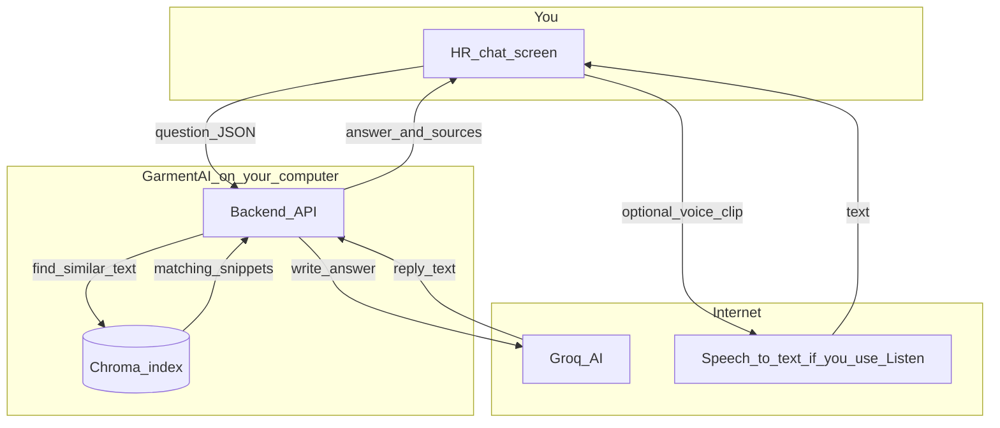
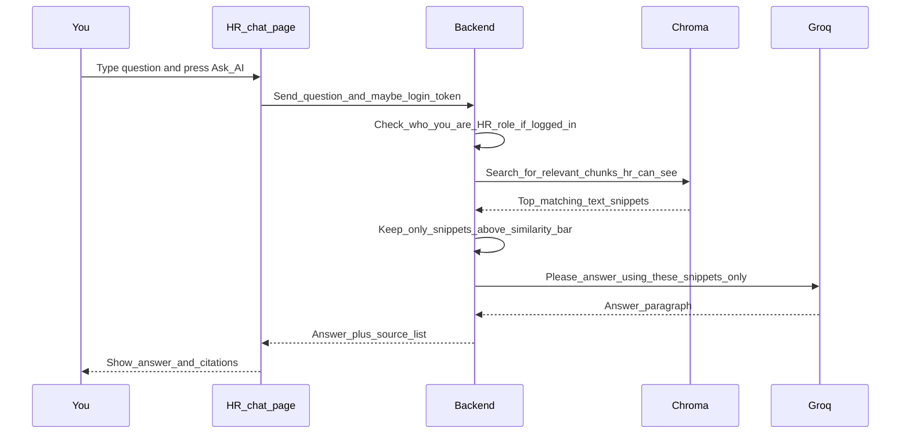
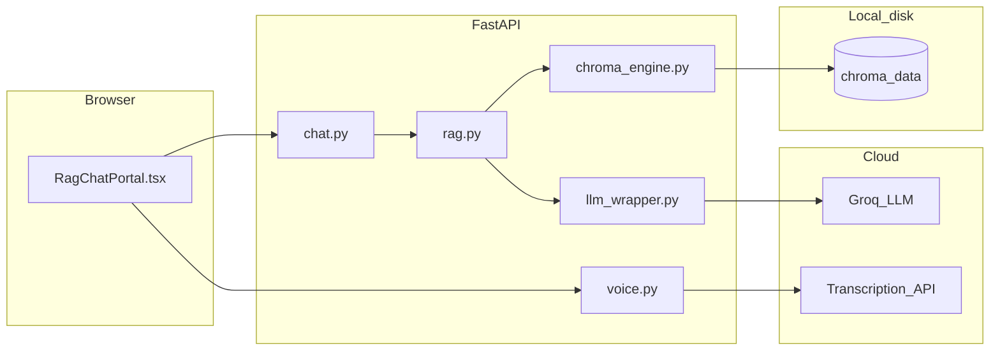

# HR chat — how it works (plain English)

This page explains **AI Chat (HR)** in the GarmentAI app: what happens when an HR manager types a question, where answers come from, and what is **not** connected yet.

---

## In one sentence

You ask a question in the browser → the **backend** searches a **local knowledge index** (Chroma) for relevant text → a **Groq** language model writes an answer using **only** that text (plus safe fallbacks) → you see the answer and optional **source titles**.

---

## The big picture (simple)

Think of three boxes:

1. **Your browser** — the HR chat screen (`/hr/chat`).
2. **GarmentAI API** — your FastAPI server (Python).
3. **Brain + library** — **Chroma** (saved snippets from laws, manuals, etc.) and **Groq** (the AI that writes sentences).

**Important:** **HR documents** uploads are saved on disk, then a **background job** extracts text (PDF via `pymupdf4llm`), splits into chunks, embeds with **`intfloat/multilingual-e5-small`**, and stores them in Chroma collection **`hr_uploads`**. HR chat searches that collection too. Re-running `python scripts/ingest_laws.py` **without** `--no-clean` **wipes** all Chroma data including `hr_uploads` — use `--no-clean` or re-upload/re-index after a full rebuild.

---

## Step by step: you click “Ask AI”

**Plain words:**

- The server treats you as **HR** (`hr_staff`) when you are logged in, so it only pulls document snippets your role is allowed to see.
- If nothing matches well enough, the app still replies — but it should **not** invent fake law quotes; the code tells the model to be honest when the library has nothing solid.
- **Listen** records your voice, sends audio to **transcribe**, puts text in the box — you still press **Ask AI** to run the flow above.
- **Read aloud** uses the **browser’s** built-in speech (no extra server).

---

## What each part of the project does

| Piece | What it is |
|-------|------------|
| [HR chat page](../frontend/src/app/(dashboard)/hr/chat/page.tsx) | Opens the chat UI for HR. |
| [RagChatPortal](../frontend/src/components/chat/RagChatPortal.tsx) | The actual chat: languages, topic chips, Ask AI, voice button, citations. |
| [rag.ts](../frontend/src/lib/api/rag.ts) | Sends your question to `/api/chat`; adds your **login token** if you have one. |
| [chat.py](../backend/api/chat.py) | Receives the question, decides **role** (from token or body), runs RAG. |
| [rag.py](../backend/services/rag.py) | Search Chroma → filter by quality → call Groq with a strict “use only this text” instruction. |
| [chroma_engine.py](../backend/services/chroma_engine.py) | Vector search + **who can see which chunk** (worker vs HR vs compliance). |
| [voice API](../backend/api/voice.py) | Turns short voice recordings into text for the input box. |

---

## HR vs worker chat (difference)

Same engine; different **labels**, **suggested topics**, and **which documents** the role may see. HR chat does **not** show the worker “helpline” card.

---

## Data you should know about

| Storage | Role in HR chat |
|---------|------------------|
| **Chroma** (`data/chroma_data/`) | The “library” the chat searches. Built by your team using ingest scripts. |
| **Groq** | Cloud AI that **words** the answer (needs `GROQ_API_KEY`). |
| **HR uploads folder** (`data/hr_uploads/`) | **Not searched by chat today** until you add an “ingest this file” step into Chroma. |

---

## Ideas for later (not built yet)

1. **After each HR upload** — automatically chunk, embed, and add to Chroma so chat can use new PDFs.
2. **Stronger security** — require login for all chat (`ENFORCE_AUTH_CHAT=true` in config).
3. **Factory filter** — send `factory_id` so answers prefer one factory’s tenant docs.

---

## Technical diagram (for developers)

Same architecture as above, with filenames:

---

*GarmentAI / Experiment — update when ingestion or auth rules change.*
